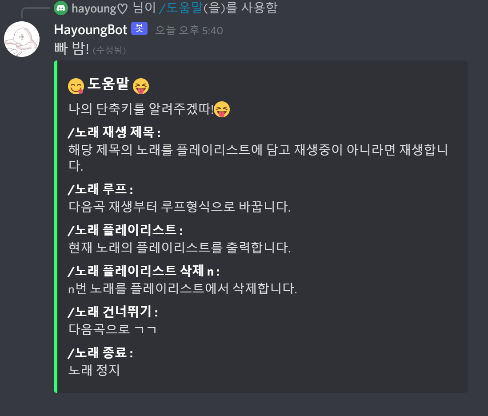

# 😀HayoungBot
 discord bot for streaming music and other funtion


### development environment

- Node  version 17.0
- discord.js  v13  ( 😠Requires node 16.6 or higher)
- 

### 다음의 기능을 가지는 디코봇




## ✅Curriculum


### 10/29 

- #### Create discord bot - discord develop portal 

- #### Get bot token , Invite bot to server(guild)

- #### Install node libray for control discord bot

  - ├── @discordjs/builders@0.7.0
  - ├── @discordjs/opus@0.6.0
  - ├── @discordjs/rest@0.1.0-canary.0
  - ├── @discordjs/voice@0.6.0
  - ├── discord-api-types@0.24.0
  - ├── discord.js@13.2.0
  - ├── events@3.3.0
  - ├── ffmpeg-static@4.4.0
  - ├── ffmpeg@0.0.4
  - ├── libsodium-wrappers@0.7.9
  - ├── yt-search@2.10.2
  - └── ytdl-core@4.9.1

- #### Design command 

  - /server , /ping, /user
  - /노래 (재생,루프 플레이리스트,건너뛰기,종료)

- #### deploy-commands.js


### 21/11/ 1

- #### ▶/노래 재생 구현

- #### ⏹/노래 종료

- #### ✅/노래 플레이리스트 (확인)

- #### ➖/노래 플레이리스트 삭제


### 21/11/ 2

- #### code optimization, Solve BUG

- #### markdown

- #### GIT


# Description

### Discord 명령어 작동 방식

- ####  /command 과 같은 슬래시 커맨드를 사용하기 위해 임의의 명령어들을 rest통신으로 서버(길드)에 명령어를 등록해두고  (deploy-commands.js)

- #### Discord 서버에서 그 명령어를 입력 할 시 봇 interaction에 해당 명령어 이름과 함께 메시지가 발신된 채널 ,사용자등에 정보가 수신된다.  

- #### Interaction 내부에서 명령어에 따라 바로 대응하거나 command 객체를 찾아 함수 실행

#### 


## deploy-commands.js

### ✔ js script to declare commands to the server

```javascript
const { SlashCommandBuilder } = require('@discordjs/builders');
const { REST } = require('@discordjs/rest');
const { Routes } = require('discord-api-types/v9');
const { clientId, guildId,token } = require('./config.json'); //get data

const commands = [ // Slash commands 선언   
	new SlashCommandBuilder().setName('ping').setDescription('Replies with pong!'),
	new SlashCommandBuilder().setName('server').setDescription('Replies with server info!'),
	new SlashCommandBuilder().setName('user').setDescription('Replies with user info!'),
	new SlashCommandBuilder().setName('도움말').setDescription('도움말 알려줌'),
	
    // 가져올때 다른 데이터도 가져오기 위한 command option 추가
	new SlashCommandBuilder().setName('노래').setDescription('유튜브에서 노래를 찾고 재생하는 기능을 실행시키는 명령어')
	.addStringOption(option => option.setName("옵션").setDescription("서브 명령어").setRequired(true))]
	.map(command => command.toJSON());

const rest = new REST({ version: '9' }).setToken(token);

// Declare commands to server
rest.put(Routes.applicationGuildCommands(clientId, guildId), { body: commands })
	.then(() => console.log('Successfully registered application commands.'))
	.catch(console.error);
```


## Discord bot init

discord bot 실행시 처음 부분

```javascript
const { Client, Intents, DiscordAPIError} = require('discord.js');
const {Collection}=require('discord.js')
const { token } = require('./config.json');
const Discord = require('discord.js')

//Permission settings allowed by the bot
//Only permissions allowed in the server (guild) can be set in advance
myIntents =new Intents() 
myIntents.add(Intents.FLAGS.GUILD_PRESENCES, Intents.FLAGS.GUILD_MEMBERS,Intents.FLAGS.GUILDS, Intents.FLAGS.GUILD_VOICE_STATES);

// Client 봇 객체
const client = new Client({ intents:myIntents });
client.commands=new Collection()

// Import the commands to be registered in the bot 
// -----a file stored in "./commands" as in the discord.js docu example
const fs=require('fs')
const commandFiles=fs.readdirSync('./commands').filter(file=>file.endsWith('.js'))
for(const file of commandFiles){
	console.log(file)
	const command=require(`./commands/${file}`)
	client.commands.set(command.name,command)
}

// bot ready check
client.once('ready', () => {
	console.log('Ready!');
});

// Create bot interaction 
client.on('interactionCreate', async interaction => {
	if (!interaction.isCommand()) return;
	const { commandName } = interaction; //명령어 명 
    // If the response takes a long time, an error occurs, so respond first
	await interaction.reply(`수행 중`);

	try {
		if (commandName === 'ping') { // 단순한 명령어는 바로 응답-
			await interaction.editReply('Pong!');
		}
        if(commandName ==='노래'){  
            // commands에 선언되어 있는 명령어는 command객체를 찾아 넘기기
			const command = client.commands.get(interaction.commandName);
			await command.execute(interaction,interaction.options.get("옵션").value.split(" "));
		}
    }catch (error) {// 에러 
		console.error(error); 
		await interaction.editReply({ content: 'error', ephemeral: true });
	}
});
    
client.login(token); // bot 실행


```


## Discord command

### js file inside "./command" 

```javascript
const Discord = require('discord.js')
module.exports = {
    name: '노래',
    description: '유튜브에서 노래를 찾고 재생하는 기능을 실행시키는 명령어',
    async execute(message, args) {
        // define
    }
}
```


## 💬Discord bot  -send message

- #### Discord bot sends messages in two main ways. ( 사람이 보내는것도 동일하지만)

- #### message send : 메시지 채널 -channel 객체를 가지고 있어야 한다.

  - ```javascript
    // channel객체를 가지고 있을 때
    channel.send("메시지 보낼게요!")
    // in interaction
    interaction.channel.send("메세지")
    ```

- #### message reply : 응답 메시지 - 수신된 메시지가 있어야 사용가능하며 한 번만 보낼 수있어 대답을 하고 수정하거나 send message르 사용하는 식, 또한 메시지 수신 15분 후 토큰이 만료되어 대답을 하거나 수정할 수 없음

  - ```javascript
    // There must be a received message first, and it can only be sent once
    //(modification is possible)
    //you cannot respond or modify the response 15 minutes after receiving the message.
    // in interaction
    
    interaction.reply("waiting answer")
    //Because a reply message can only be sent once
    interaction.editreply("sure")
    interaction.editreply("no")
    ```


## 🔤Discord bot Embed Message 

박스 형태로 사진, 동영상 url등으로 멀티미디어 메시지 느낌? 색 글씨 크기 등등 지정가능

As of Discord v13,  the message has been changed to contain multiple embeds.

```javascript
const myembed1=new Discord.MessageEmbed().
setTitle("embed1").setTitle("😋 도움말 😝").
setDescription("나의 단축키를 알려주겠따!😝").setColor("#33ff73")
const myembed2=new Discord.MessageEmbed().setTitle("embed2")
const myembed3=new Discord.MessageEmbed().setTitle("embed3")
                                                   
//before v12
channel.send(myembed1) // no longer working
//change v13
channel.send({ embeds : [myembed1,myembed2]})

```


## #️⃣ Music command

### library 

```javascript
// A library that creates stream objects from YouTube URLs.
const ytdl = require('ytdl-core') 

// Extract search url and title from YouTube with specific keywords
const yts = require('yt-search') 

const {
   AudioPlayerStatus, 
   StreamType,
   createAudioPlayer,
    VoiceConnectionStatus ,
   createAudioResource,
   joinVoiceChannel,
    getVoiceConnection
} = require('@discordjs/voice'); // discord voice

const Discord = require('discord.js')

```

### Variable

```javascript
// 봇에서 계속 사용할 변수 
const Playlist = new Discord.Collection()
//Playlist[guildid] => Collection for each guild
//Playlist[guildid]["musicplaylist"] => musicplaylist for guild
//Playlist[guildid]["isloop"] => islook for guild

module.exports = { // command 정의
    name: '노래',
    description: '유튜브에서 노래를 찾고 재생하는 기능을 실행시키는 명령어',
    async execute(message, args) { // interaction 수행
        var PlaylistArray = new Array()
        const MGI = message.guild.id
        // 길드 컬렉션 가져오기
        if (!Playlist.has(MGI)) Playlist.set(MGI, new Discord.Collection())
        else PlaylistArray =  Playlist.get(MGI).get("musicplaylist")
        console.log("MGI-길드 컬렉션 생성")
        
        //길드 컬렉션에서 음악리스트 추출
        const MPL = await Playlist.get(MGI).get("musicplaylist")
        if (MPL == null)  Playlist.get(MGI).set("musicplaylist", PlaylistArray)
        
        //길드 컬렉션에서 반복여부 가져오기
        isLoop = Playlist.get(MGI).get("isloop")
        if(isLoop==null) {
            Playlist.get(MGI).set("isloop",false)
            isLoop=false
        }
    }
}
```

### Check the voice channel to which the sender belongs

```javascript
// 메시지를 보낸 유저가 속해있는 음성채널 가져오기
const voiceChannel = <interaction>message.member.voice.channel
// 메시지를 보낸 유저가 음성 채널에 들어가 있는지 확인
if (!voicechannel) return message.editreply("음성채널에 들어가 주세요")


```

### ➿ music search 

```javascript
const yts = require('yt-search')

async function search_youtube_music(music_name){
    const r =await yts(music_name)
    const videos= r.videos.slice(0,1)
    return videos[0] //가장 위에 객체 리턴
}
```

### ▶ Play music in Voice Channel

```javascript
const ytdl = require('ytdl-core')

async function music_play(message, voiceChannel){
    // voice channel 접속부
    const voice= joinVoiceChannel({
        channelId:voiceChannel.id,
        guildId:voiceChannel.guild.id,
        adapterCreator:voiceChannel.guild.voiceAdapterCreator
    })
    // get music url
    const musicurl=search_youtube_music("title").url
    // convert stream
    const stream= ytdl(music.url,{filter : 'audioonly'})
    const resource = createAudioResource(stream,
              { inputType :StreamType.Arbitrary});
    const player=createAudioPlayer()

    player.play(resource)
    voice.subscribe(player);

    player.on(AudioPlayerStatus.Idle, () => 
  /* stream 종료 시 실행 (ex . disconect voice channel , replay music, ...) */
             );
    player.on("error", console.error);
    
    
}
```

